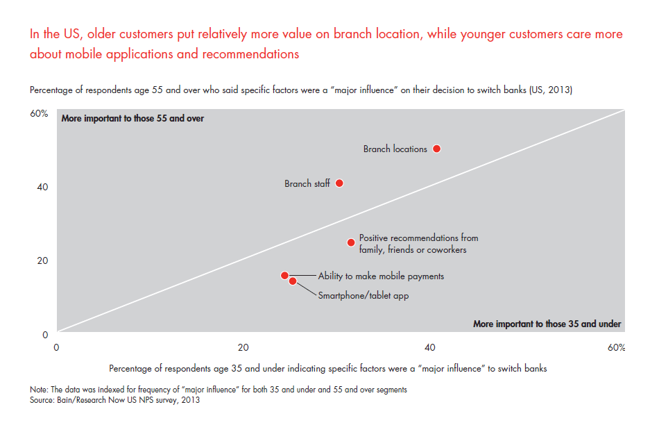
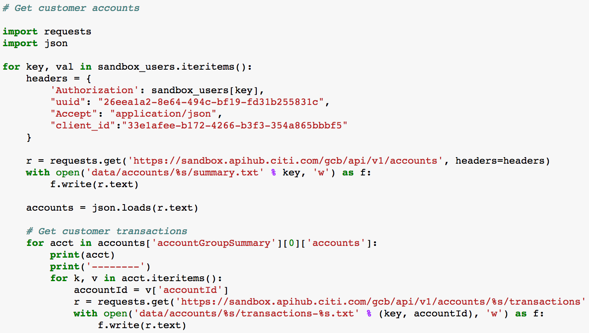

<!-- $theme: gaia -->

# Better Banking with CitiFitz
#### -  CITI HK FINTECH CHALLENGE 2017
###### by Charlie Chen ( [@Carolusian](https://github.com/carolusian) )
###### 

---

###### [Customer Loyalty in Retail Banking: Global Edition 2013](http://www.bain.com/publications/articles/customer-loyalty-in-retail-banking-2013.aspx)

---

## The younger generation

* The survey above shows, mobile/digital banking is more popular than branch banking;
* They rely heavily on recommendations from their social network, such as family, friends and colleagues;
* Than means, banks increasingly have opportunities to excel at moments of truth in the customer experience.

---

## The Simplicity of Citi API 

###### * Citi API code sample

---

## The Limitation of  Citi API

* The above code shows the simplitiy of calling Citi API to obtain various information given the authorisation from the customers;
* However, even it makes the data accessible much easier;
* It still only have a single view of the customers;
* It is hard to drive better and personalised experience with only those data.

---

## Beyond Banking with Pedometer

#### The basic ideas:

* Know where your customers are;
* Keep your app running on their mobile devices;
* Then, you app will be much more capable to gather data;
* We can understand our customers with more data;
* Produce proper and more personalised offers;

---

## Beyond Banking with Pedometer

#### The basic ideas:

* Increasing customer engagement by setting goals for your customers;
* Increasing customer loyalty, attracting new customers, and minimizing competive pressure;
* Reaching target customers through marketing campaigns ahead of competitors.

